# AWS EC2 + Custom VPC with Terraform

> **Full deployment walkthrough also published on Medium:**
> [Deploying AWS EC2 in a Custom VPC with Terraform — A Real Deployment Guide](https://medium.com/@greg.ethel)

Automated deployment of an Ubuntu 20.04 EC2 instance inside a custom AWS VPC
using Terraform. Deployed to **ca-central-1 (Canada Central)**.

---

## Architecture
```
Internet
    │
    ▼
Internet Gateway (igw-050ebf8667f6b0b1a)
    │
    ▼
VPC: 10.0.0.0/16 (terraform-vpc)
    ├── Public Subnet:  10.0.1.0/24  (ca-central-1a) ← EC2 lives here
    └── Private Subnet: 10.0.2.0/24 (ca-central-1b)
            │
            ▼
    Route Table → IGW (0.0.0.0/0)
            │
            ▼
    Security Group: TCP 22 (SSH) + TCP 80 (HTTP)
            │
            ▼
    EC2: Ubuntu 20.04 | t3.micro | Public IP: 15.157.63.146
```

---

## Resources Created

| Resource | Name | Detail |
|---|---|---|
| VPC | terraform-vpc | CIDR: 10.0.0.0/16 |
| Public Subnet | terraform-public-subnet | 10.0.1.0/24 — ca-central-1a |
| Private Subnet | terraform-private-subnet | 10.0.2.0/24 — ca-central-1b |
| Internet Gateway | terraform-igw | Attached to VPC |
| Route Table | terraform-public-rt | 0.0.0.0/0 → IGW |
| Security Group | terraform-web-sg | SSH (22) + HTTP (80) |
| EC2 Instance | terraform-web-server | Ubuntu 20.04 — t3.micro |

---

## Prerequisites

- AWS account with IAM user `terraform-admin` (AdministratorAccess)
- AWS CLI configured with named profile:
```bash
aws configure --profile terraform-admin
# Region: ca-central-1
```

- Terraform >= 1.5.0
- RSA key pair imported to AWS:
```bash
aws ec2 import-key-pair \
  --key-name "terraform-key" \
  --public-key-material fileb://~/.ssh/id_rsa.pub \
  --region ca-central-1 \
  --profile terraform-admin
```

---

## Usage
```bash
# Clone the repo
git clone https://github.com/gregodprogrammer/terraform-aws-vm.git
cd terraform-aws-vm

# Initialise
terraform init

# Preview
terraform plan

# Deploy
terraform apply

# Visit Nginx at:
# http://<public_ip>

# Clean up
terraform destroy
```

---

## Deployment Walkthrough

### Step 1 — Configure AWS CLI & Verify Credentials
```bash
aws configure --profile terraform-admin
aws sts get-caller-identity --profile terraform-admin
```

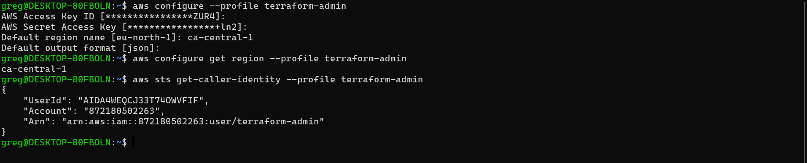

---

### Step 2 — Verify Terraform Version
```bash
terraform version
```

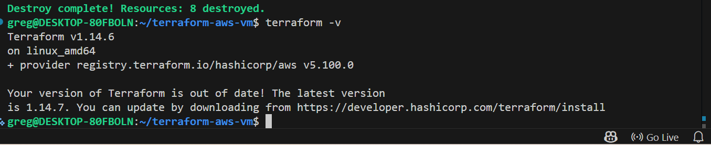

---

### Step 3 — Project Structure
```
terraform-aws-vm/
├── main.tf
├── .gitignore
├── README.md
└── screenshots/
```


---

### Step 4 — main.tf VPC Block

Provider set to `ca-central-1` with named profile `terraform-admin`.
VPC, subnets, IGW and route table defined.

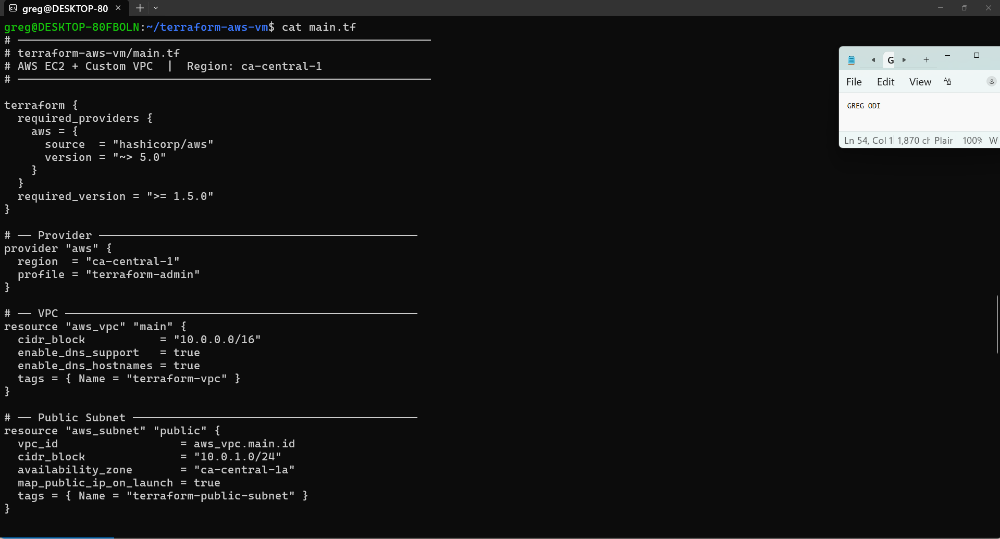

---

### Step 5 — main.tf EC2 Block

Security group, EC2 instance, and output blocks.

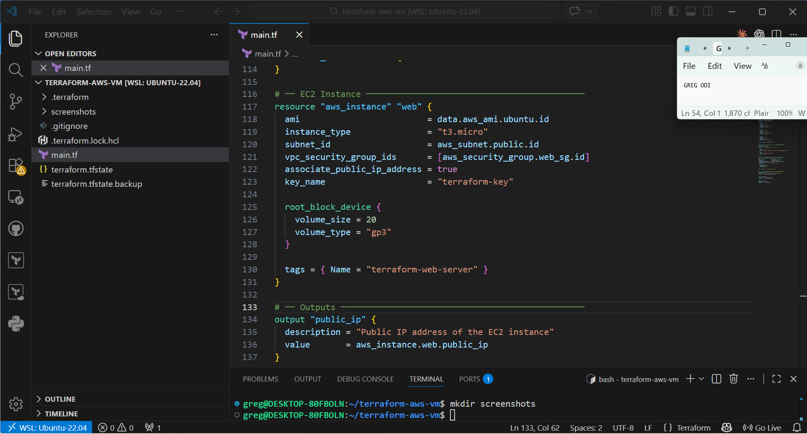

---

### Step 6 — terraform init

Downloads `hashicorp/aws v5.100.0` provider.
```bash
terraform init
```

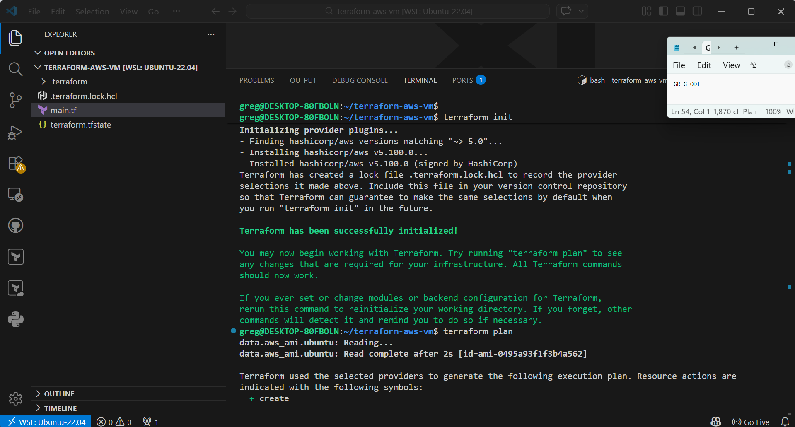

---

### Step 7 — terraform plan
```bash
terraform plan
```

Plan confirms: **8 to add, 0 to change, 0 to destroy**

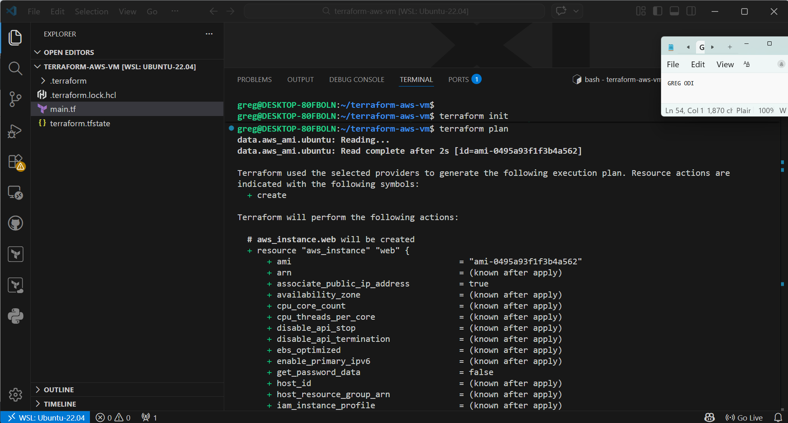

---

### Step 8 — terraform apply (Running)

Resources created in dependency order — VPC first, EC2 last.
```bash
terraform apply
```

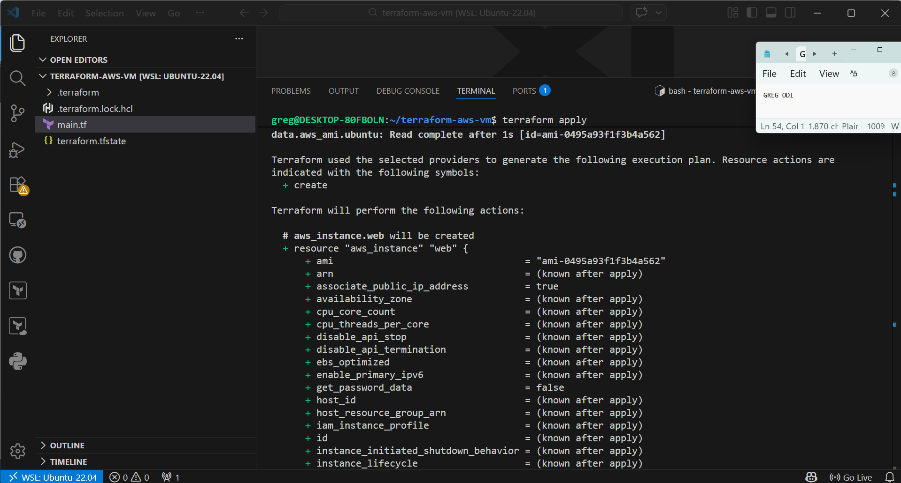

---

### Step 9 — terraform apply (Complete)
```
Apply complete! Resources: 8 added, 0 changed, 0 destroyed.

Outputs:
instance_id = "i-03d28e096b02f5848"
public_ip   = "15.157.63.146"
vpc_id      = "vpc-05387c2c8c7abf419"
```

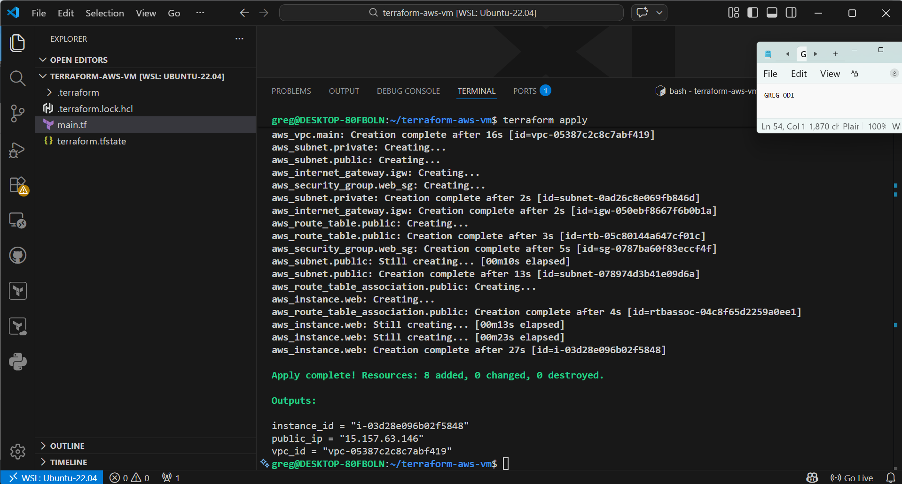

---

### Step 10 — EC2 Instance Running in AWS Console

Instance `terraform-web-server` confirmed running in ca-central-1.
Public IP `15.157.63.146` matches Terraform output.

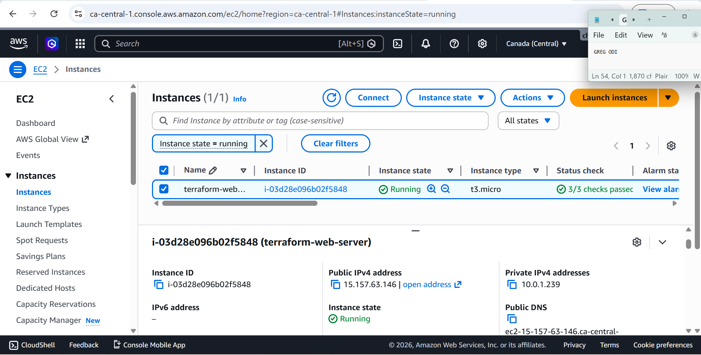

---

### Step 11 — VPC Console

Custom VPC `terraform-vpc` confirmed with CIDR `10.0.0.0/16`.

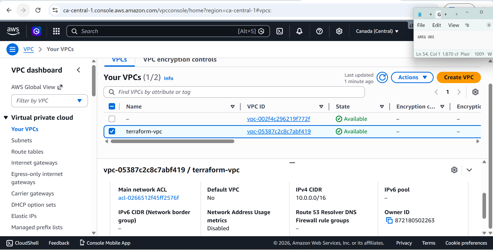

---

### Step 12 — Subnets Console

Both subnets confirmed by filtering by VPC ID `vpc-05387c2c8c7abf419`.

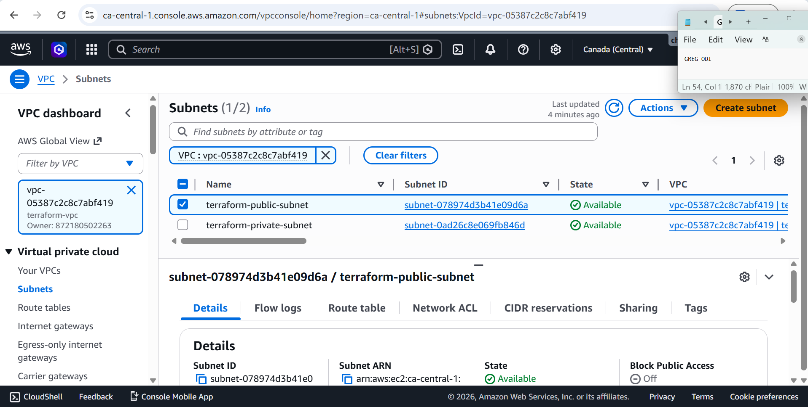

---

### Step 13 — Security Group Rules

Inbound rules: TCP 22 (SSH) and TCP 80 (HTTP) from `0.0.0.0/0`.

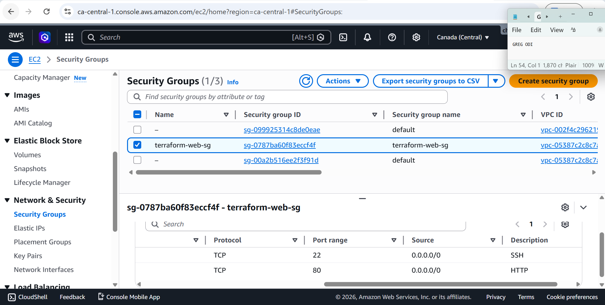

---

### Step 14 — SSH Connection
```bash
ssh -i ~/.ssh/id_rsa ubuntu@15.157.63.146
```

Connected as `ubuntu@ip-10-0-1-239` — inside public subnet `10.0.1.0/24`.

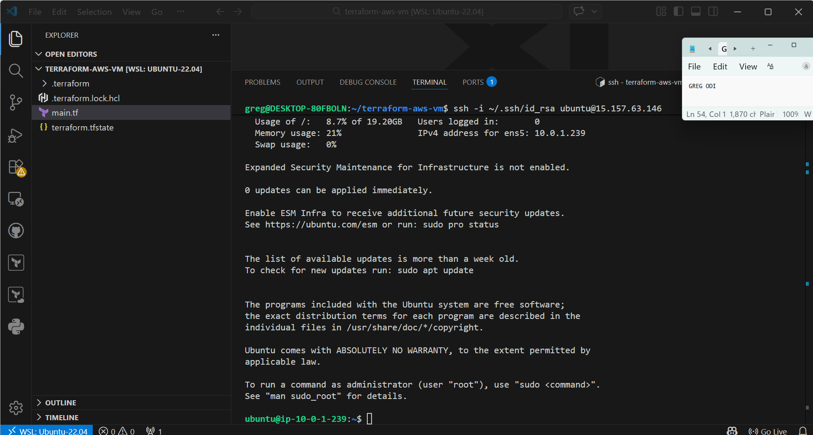

---

### Step 15 — Nginx Install
```bash
sudo apt update -y
sudo apt install nginx -y
sudo systemctl start nginx
sudo systemctl enable nginx
sudo systemctl status nginx
```

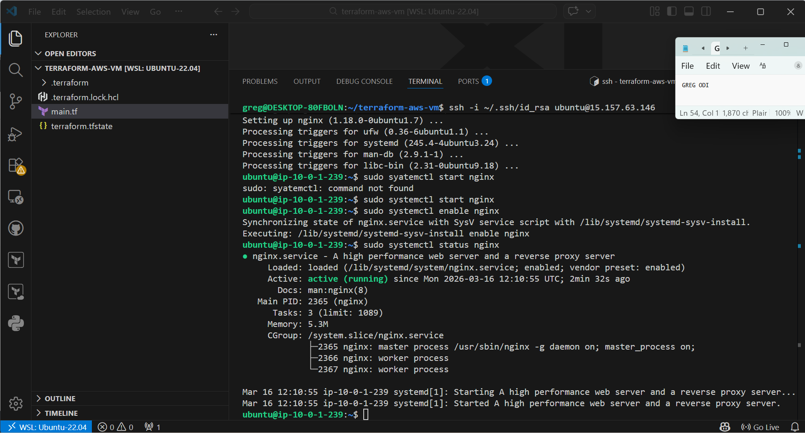

---

### Step 16 — Nginx Browser Test

Navigated to `http://15.157.63.146` — Nginx default page confirmed.

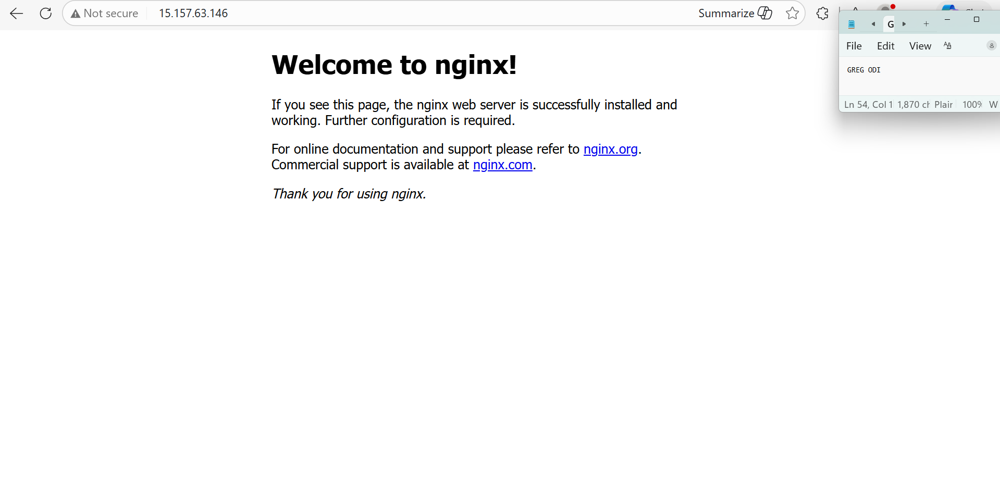

---

### Step 17 — terraform destroy
```bash
terraform destroy
```
```
Destroy complete! Resources: 8 destroyed.
```

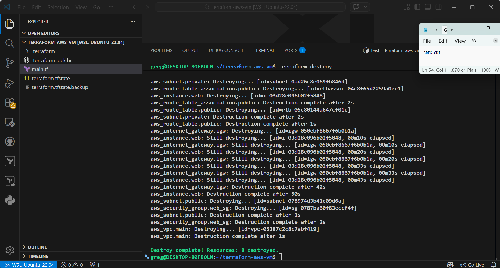

---

## Real Issues Encountered

| # | Issue | Cause | Fix |
|---|---|---|---|
| 1 | Only root account — no IAM user | Started with root credentials | Created `terraform-admin` IAM user with AdministratorAccess |
| 2 | Multiple RSA keys in `~/.ssh/` | id_rsa, id_ed25519, newkey, lastestkey all present | Used `id_rsa.pub` — imported to AWS as `terraform-key` |
| 3 | CLI region saved as `eu-north-1` | Pressed Enter too fast during configure | Re-ran `aws configure --profile terraform-admin` |
| 4 | AWS Console showing wrong region | Console region ≠ deployment region | No fix needed — Terraform uses provider block region |
| 5 | Private subnet appeared missing | Default VPC subnets mixed in unfiltered list | Filtered Subnets by VPC ID `vpc-05387c2c8c7abf419` |
| 6 | `nginx.service not found` | Ran `systemctl` before `apt install` finished | Waited for apt install to fully complete |
| 7 | Typo `syatemctl` | Manual typing error | Retyped `systemctl` correctly |
| 8 | `YOUR_USERNAME` not replaced in git remote | Used placeholder literally | Replaced with actual username `gregodprogrammer` |
| 9 | `remote origin already exists` | Ran `git remote add` twice | Ran `git remote remove origin` first |
| 10 | `Repository not found` on push | GitHub repo not created before pushing | Created repo at github.com/new first |

---

## Author

**Greg Odi**
- GitHub: [@gregodprogrammer](https://github.com/gregodprogrammer)
- Medium: [@greg.ethel](https://medium.com/@greg.ethel)

---

## License

MIT
